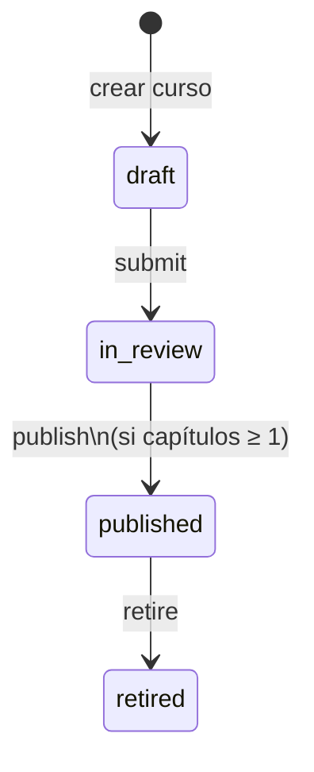

# 2. Especificación Funcional (Spec) — Campus Marte

> **Fase SDD:** `2/4 — Specification`
> **Estado:** `🟡 En revisión — pendiente de aprobación (v1.0.0)`
> **Versión:** `1.0.0`
> **Última actualización:** 2026-09-16
> **Trazabilidad:** deriva de [`1_intent.md`](./1_intent.md) v1.0.0 (🟢 aprobado 2026-09-16: Naive UI, EC2+subdominio, repo `joaldico/marte-campus`)
> **Principio rector:** el cliente **pinta**; el servidor **decide**. Progreso, “capítulo visto”, heatmap y transiciones de estado no existen como lógica de negocio en Vue.

---

## 2.1. Alcance

### Dentro (MVP = enunciado 3.1–3.4)

- Seed 3.1 (usuarios, vídeos, cursos, inscripciones, CSV de eventos **con suciedad**).
- Login sin contraseña (lista de usuarios) + sesión de servidor.
- Catálogo alumno, inscripción, reproductor, barra de tramos, resume, persistencia al cerrar pestaña.
- Admin: cursos, capítulos (título+URL), drag-and-drop de orden, máquina de estados **cerrada**, versionado al editar publicado, import CSV, heatmap por vídeo.
- OpenAPI en `/api/docs`. UI Naive UI + logo Josué.
- `docker compose up` + recarga a cero. Demo `https://beonittest.josuediazcontreras.com`.

### Fuera

- Bonus del enunciado §4 (mp4 upload, subtítulos, heatmap en alumno, revisor ≠ autor, E2E compose).
- Auth con contraseña / OAuth / JWT de producción.
- Microservicios, K8s, RDS, CDN propio.
- Cualquier transición de estado **no listada en §2.6** (el servidor la rechaza; no se “completa” el ciclo de vida por UX).

---

## 2.2. Datos de partida (canónicos)

### 2.2.1. Usuarios

| id | Nombre | role |
|---|---|---|
| `ana` | Ana | `admin` |
| `bruno` | Bruno | `student` |
| `carla` | Carla | `student` |
| `diego` | Diego | `student` |

Login: `POST /api/auth/login { userId }` emite cookie de sesión httpOnly. No hay contraseña.

### 2.2.2. Vídeos

URLs = hipervínculos del PDF (no el texto recortado de la tabla). `durationSeconds` se mide al seed (HEAD/ffprobe o probe del contenedor) y se persiste. Un capítulo **no** puede marcarse visto si `durationSeconds` es null.

| id | URL |
|---|---|
| `playa` | `https://archive.org/download/Flickr-4360457374/03b_Dockwiler_Beach_-_Ocean_Waves-4360457374.mp4` |
| `cascada` | `https://archive.org/download/HiddenWaterfall2WS/HiddenWaterfall2WS_512kb.mp4` |
| `bosque` | `https://archive.org/download/SilentForestCCBYNatureClip/Silent%20Forest%20CC-BY%20NatureClip%20.mp4` |
| `atardecer` | `https://archive.org/download/Flickr-5419851044/timelapse_gear_test_-_the_sunset_that_hid_behind_the_clouds-5419851044.mp4` |
| `auroras` | `https://archive.org/download/Flickr-10745021235/Northern_lights_timelapse-10745021235.mp4` |
| `largo` | `https://archive.org/download/VermontWaterfallEarlySpring/VermontWaterfallSunsetGlancesbyedwardhuse2011edhuse.com1hd720_512kb.mp4` |

`auroras` no está en ningún curso del seed (disponible para que Ana lo asigne).

### 2.2.3. Cursos

| Curso | status | Capítulos (orden) | Notas |
|---|---|---|---|
| Paisajes I | `published` | 1. Playa (`playa`) · 2. Cascada (`cascada`) · 3. Bosque (`bosque`) | Única oferta del catálogo alumno |
| Paisajes II | `in_review` | 1. Cascada larga (`largo`) · 2. Atardecer (`atardecer`) | Invisible al alumno |
| Paisajes III | `draft` | ninguno | No se puede publicar hasta tener capítulos |

Inscripciones: Bruno y Carla → Paisajes I. Diego → ninguna.

### 2.2.4. Eventos de seed — perfilado (esto son requisitos, no anécdotas)

| # | Fila | Lectura | Política (EB) |
|---|---|---|---|
| 1 | Bruno `playa` 0–10 | Válido | Persistir; une |
| 2–5 | Bruno `cascada` 0–4, 3–7, 8–11, **0–4 duplicado** | Solapes + duplicado | Unión: `[0,7) ∪ [8,11)` = **10 s**. El duplicado no suma |
| 6 | Bruno `atardecer` 0–27 | Vídeo existe, curso **no publicado** | Persistir a nivel **vídeo+usuario**. No aparece en progreso de Paisajes I. Si un día se publica Paisajes II y Bruno se apunta, **sí** cuenta |
| 7–9 | Carla `playa` 5–10 @x2, 0–5 @x2, 2–4 @x1 | x2 y solapes | `rate` **no** dilata ni comprime el intervalo. Unión `[0,10)` = **10 s** de vídeo |
| 10 | Carla `cascada` **8–2** | `from >= to` | **Rechazar** (`rejected_inverted`). No entra en la unión |
| 11 | Carla `bosque` 0–25 | Válido | 25 s |
| 12 | Carla `rio` 0–10 | Vídeo **inexistente** | `rejected_unknown_video`. Import no aborta. No hay fila de progreso |
| 13 | Diego `playa` 0–10 | No inscrito | Persistir a nivel vídeo. **Catálogo:** Diego no ve progreso de Paisajes I (no apuntado). Al apuntarse, esos 10 s **cuentan** |

Toda fila rechazada se guarda en `playback_events` con `accepted=false` y `rejectReason` (auditoría del import). El progreso **solo** usa `accepted=true`.

---

## 2.3. Requisitos funcionales

| ID | Requisito | Pri. | OBJ | BDD |
|---|---|---|---|---|
| RF-01 | Lista de usuarios + login sin contraseña + sesión servidor + logout | Must | — | CA-01 |
| RF-02 | Alumno ve **solo** cursos `published` en catálogo | Must | — | CA-02 |
| RF-03 | Alumno se apunta a un publicado; `retired` rechaza altas (409) | Must | OBJ-04 | CA-02 |
| RF-04 | Progreso de curso/capítulo **solo** si está apuntado; fórmula §2.5 | Must | OBJ-03 | CA-03 |
| RF-05 | Reproductor: vídeo, lista capítulos, barra de tramos **devueltos por API**, resume | Must | OBJ-03 | CA-04 |
| RF-06 | Mientras reproduce, el cliente envía eventos brutos; el servidor valida, une y devuelve rangos | Must | OBJ-03 | CA-04 |
| RF-07 | Cerrar pestaña no pierde tramos ya enviados; flush ≤ 5 s + `visibilitychange`/`pagehide` | Must | OBJ-06 | CA-04 |
| RF-08 | Admin lista todos los cursos con estado; crea curso (draft) y capítulos título+URL | Must | — | CA-05 |
| RF-09 | Reordenar capítulos de la **versión de trabajo** por drag-and-drop (PATCH orden) | Must | — | CA-05 |
| RF-10 | Transiciones **solo** las de §2.6; resto 409 `STATE_TRANSITION_FORBIDDEN` | Must | OBJ-04 | CA-06 |
| RF-11 | `in_review → published` exige ≥ 1 capítulo | Must | OBJ-04 | CA-06 |
| RF-12 | Editar curso `published` clona versión de trabajo en draft; alumnos siguen en `publishedVersionId` | Must | — | CA-07 |
| RF-13 | Publicar revisión (curso ya published) sustituye `publishedVersionId`; progreso se re-agrega **por videoId** | Must | — | CA-07 |
| RF-14 | Import CSV formato 3.1; respuesta con conteos accepted/rejected; heatmap por vídeo | Must | OBJ-03 | CA-08 |
| RF-15 | OpenAPI generado en `/api/docs` = contratos reales | Must | OBJ-08 | — |
| RF-16 | Recarga a cero documentada restaura §2.2 | Must | OBJ-01/02 | — |

---

## 2.4. Requisitos no funcionales

| ID | Categoría | Requisito | Métrica |
|---|---|---|---|
| RNF-01 | Arranque | `docker compose up` en limpio | UI+API+DB+seed, sin pasos extra no documentados |
| RNF-02 | Integridad | Cero lógica de progreso en Vue | El único `union`/`90%` vive en `ProgressEngine` (tests). Vue asigna `ranges` del JSON |
| RNF-03 | Consola | Happy path sin errores browser/API | 0. Incluye favicon/logo y vídeo (proxy si CORS) |
| RNF-04 | Vídeo | Reproducción con Range | Si archive.org falla CORS, `GET /api/videos/:id/stream` proxy con `Accept-Ranges` |
| RNF-05 | Latencia eventos | `POST /api/playback/events` | p95 < 200 ms en local (un evento) |
| RNF-06 | Seguridad demo | Postgres no publicado a internet; cookie `Secure` en HTTPS, `SameSite=Lax` | Nmap de compose prod: 80/443 proxy only |
| RNF-07 | Observabilidad | Logs JSON: `requestId`, `userId`, `event` | Filtrable |
| RNF-08 | UI | Naive UI + logo `/logo.png` | Header en todas las pantallas autenticadas |

---

## 2.5. Motor de progreso (servidor)

Intervalo semiabierto `[from, to)` en **segundos de vídeo**. `rate` es metadato; **no** entra en la fórmula (x2 ya recorre el doble de vídeo en el mismo reloj: el `to-from` ya es tiempo de vídeo).

### Funciones puras (puerto `ProgressEngine`)

```ts
export type Interval = { from: number; to: number };

export interface ChapterProgressView {
  uniqueSeconds: number;
  durationSeconds: number;
  ratio: number;       // unique / duration, clamp [0,1]
  completed: boolean;  // ratio >= 0.9
}

export interface ProgressEngine {
  merge(intervals: Interval[]): Interval[];
  uniqueSeconds(intervals: Interval[]): number;
  chapterProgress(uniqueSeconds: number, durationSeconds: number): ChapterProgressView;
  courseProgress(chapters: ChapterProgressView[]): {
    averageRatio: number;
    completedCount: number;
    totalCount: number;
  };
}
```

**merge:** ordenar por `from`; unir si `next.from <= current.to`.

**chapterProgress:** si `durationSeconds <= 0` o null → `ratio=0`, `completed=false`.

**courseProgress:** media aritmética de `ratio` de los capítulos de la **versión que el alumno ve**. “El progreso de un curso es el de sus capítulos.”

**Seek:** el cliente **no** envía un intervalo del salto. Solo envía tramos de `playing` real (timeupdate acumulado). Si llegara un salto disfrazado de evento, el servidor no puede distinguirlo: la disciplina es del cliente; DECISIONS.md lo explica.

**Cierre de pestaña:** cursor de resume `playback_cursors(userId, videoId, positionSeconds)` se actualiza en cada evento aceptado (`position = to`). Al reabrir, `currentTime = cursor`. Los tramos no flusheados (≤ 5 s) pueden perderse — umbral documentado, no “cero pérdida mágica”.

---

## 2.6. Máquina de estados (cerrada — cero automático)

Estados de **curso**: `draft` | `in_review` | `published` | `retired`.

El enunciado lista el recorrido y dice que lo no escrito se rechaza. **No hay transiciones inversas.**



| from → to | Condición extra | HTTP si ilegal |
|---|---|---|
| `draft` → `in_review` | ninguna | — |
| `in_review` → `published` | versión de trabajo con ≥ 1 capítulo | 409 `COURSE_EMPTY` |
| `published` → `retired` | ninguna | — |
| **cualquier otro par** | — | 409 `STATE_TRANSITION_FORBIDDEN` |

Ejemplos de **rechazo obligatorio** (tests CA-06):

- `draft` → `published` (saltar revisión)
- `in_review` → `draft`
- `published` → `in_review` / `draft`
- `retired` → `published` / cualquier cosa
- `published` → `published` (no-op no es transición)

### Versionado (no es cambio de `course.status`)

Cuando `status=published`, `PATCH` de título de capítulo / URL / orden / alta-baja de capítulo **no muta** `publishedVersionId`. Clona (si aún no hay working distinta) una `CourseVersion` editable.

| Acción | Efecto |
|---|---|
| Editar publicado | `workingVersionId` = clone; alumnos siguen en `publishedVersionId` |
| `POST .../revisions/submit` | working `draft` → `in_review` (subestado de versión, el curso sigue `published`) |
| `POST .../revisions/publish` | working `in_review` + ≥1 capítulo → pasa a ser `publishedVersionId`. Curso sigue `published` |
| `POST .../revisions/publish` con 0 capítulos | 409 `COURSE_EMPTY` |
| `retired` | no nuevas inscripciones; inscritos conservan acceso de lectura/repro de la última publicada |

**Progreso al republicar:** se re-agrega por `videoId`. Capítulo nuevo con vídeo nuevo → 0. Mismo vídeo en otro orden → se conserva la unión. Vídeo eliminado de la versión → no cuenta en el curso; los eventos **no se borran**.

Subestados de versión `working.status`: `draft | in_review`. Transiciones de revisión:

- working `draft` → `in_review`
- working `in_review` → `published` (vía `revisions/publish`, no cambia `course.status`)
- working `in_review` → `draft` = **prohibido** (no está en el enunciado)

---

## 2.7. Autorización

| Recurso | student | admin | anónimo |
|---|---|---|---|
| `GET /auth/users` | sí | sí | sí |
| `POST /auth/login` | sí | sí | sí |
| Catálogo / inscripción / reproductor / eventos propios | sí | sí (Ana puede navegar como ella misma; no se impersona) | 401 |
| Admin cursos / import / heatmap | 403 | sí | 401 |
| Eventos de **otro** usuario | 403 | 403 (ni admin escribe progreso ajeno por el reproductor; el import CSV sí, porque es carga histórica) | 401 |

Ana no aparece como alumna en catálogo de publicados con progreso (role admin). Si se quiere probar el reproductor, el evaluador elige Bruno/Carla.

---

## 2.8. Contratos API (OpenAPI es la fuente; esto es el mapa)

Prefijo `/api`. JSON. Errores: `{ "code": "STATE_TRANSITION_FORBIDDEN", "message": "..." }`.

| Método | Ruta | Auth | Descripción |
|---|---|---|---|
| GET | `/health` | no | `{ status, db }` |
| GET | `/auth/users` | no | lista `{ id, name, role }` |
| POST | `/auth/login` | no | body `{ userId }` → `Set-Cookie` |
| POST | `/auth/logout` | sí | borra cookie |
| GET | `/auth/me` | sí | usuario actual |
| GET | `/catalog/courses` | student | publicados + `enrolled` + `progress` si enrolled |
| POST | `/catalog/courses/:id/enroll` | student | 409 si retired / ya inscrito / no published |
| GET | `/catalog/courses/:id` | student + enrolled | versión publicada: capítulos + progreso por capítulo + ranges |
| GET | `/player/chapters/:chapterId` | student + enrolled | vídeo (url o `/videos/:id/stream`), ranges, cursor, siblings |
| POST | `/playback/events` | student | body `{ videoId, from, to, rate, at? }` → `{ accepted, ranges, cursor, chapterProgress }` |
| PATCH | `/playback/cursor` | student | `{ videoId, positionSeconds }` flush de resume sin intervalo |
| GET | `/videos/:id/stream` | sí | proxy Range (si RNF-04 lo exige; si no, 302 a origen) |
| GET | `/admin/courses` | admin | todos + status + chapterCount |
| POST | `/admin/courses` | admin | `{ title }` → draft |
| GET | `/admin/courses/:id` | admin | versiones, working, published |
| PATCH | `/admin/courses/:id` | admin | `{ title }` de metadatos |
| POST | `/admin/courses/:id/transition` | admin | `{ to }` según §2.6 |
| POST | `/admin/courses/:id/chapters` | admin | `{ title, url }` en working version |
| PATCH | `/admin/courses/:id/chapters/order` | admin | `{ chapterIds: string[] }` |
| PATCH | `/admin/courses/:id/chapters/:cid` | admin | `{ title, url }` |
| DELETE | `/admin/courses/:id/chapters/:cid` | admin | working only; 409 si tocaría published version |
| POST | `/admin/courses/:id/revisions/submit` | admin | §2.6 versionado |
| POST | `/admin/courses/:id/revisions/publish` | admin | §2.6 versionado |
| POST | `/admin/events/import` | admin | `multipart/csv` → `{ accepted, rejected[] }` |
| GET | `/admin/videos/:id/heatmap` | admin | `{ durationSeconds, buckets: { t, watchedWeight, skipWeight }[] }` |

Swagger UI: `/api/docs`. Decoradores Nest (`@nestjs/swagger`) — **no** un YAML huérfano.

---

## 2.9. Puertos de dominio (interfaces limpias)

El plan técnico (hexagonal light) implementa estos puertos. Los adaptadores HTTP/DB no contienen las reglas.

```ts
export interface CourseStateMachine {
  assertCanTransition(from: CourseStatus, to: CourseStatus): void;
}

export interface PlaybackIngestor {
  ingest(input: {
    userId: string;
    videoId: string;
    from: number;
    to: number;
    rate: number;
    at: Date;
  }): { accepted: boolean; reason?: RejectReason };
}

export type RejectReason =
  | 'inverted_interval'
  | 'unknown_video'
  | 'unknown_user'
  | 'negative_or_nan'
  | 'rate_not_positive';

export interface HeatmapEngine {
  build(events: Interval[], durationSeconds: number, bucketSize: number): {
    t: number;
    watchedWeight: number;
    skipWeight: number;
  }[];
}
```

Heatmap: buckets de 1 s. `watchedWeight` = nº de eventos accepted que cubren ese segundo (no usuarios únicos: el enunciado pide “qué se ve más”). `skipWeight` = 0 si watchedWeight>0, si no 1 (segundo nunca cubierto). La UI pinta una barra (visto=color pleno, saltado=hueco).

---

## 2.10. Modelo de datos (PostgreSQL, lógico)

```mermaid
erDiagram
    users ||--o{ enrollments : apunta
    users ||--o{ playback_events : genera
    users ||--o{ playback_cursors : resume
    users ||--o{ sessions : tiene
    courses ||--|{ course_versions : versiona
    courses ||--o{ enrollments : ofrece
    course_versions ||--|{ chapters : contiene
    videos ||--o{ chapters : referencia
    videos ||--o{ playback_events : recibe
    videos ||--o{ playback_cursors : cursor

    users { text id PK, text name, text role }
    sessions { uuid id PK, text user_id FK, timestamptz expires_at }
    courses { uuid id PK, text title, text status, uuid published_version_id, uuid working_version_id }
    course_versions { uuid id PK, uuid course_id FK, text revision_status, int version_number }
    videos { text id PK, text url, float duration_seconds }
    chapters { uuid id PK, uuid version_id FK, text video_id FK, text title, int position }
    enrollments { uuid id PK, text user_id FK, uuid course_id FK, timestamptz created_at }
    playback_events { uuid id PK, text user_id FK, text video_id, float from_s, float to_s, float rate, timestamptz at, bool accepted, text reject_reason }
    playback_cursors { text user_id, text video_id, float position_seconds, timestamptz updated_at }
```

Uniques: `(user_id, course_id)` en enrollments; `(user_id, video_id)` en cursors. Capítulos: unique `(version_id, position)`.

---

## 2.11. Flujos UX

**Alumno:** Login (cards Naive UI + logo) → Catálogo (solo Paisajes I; Bruno/Carla con barra de progreso; Diego sin barra, CTA Apuntarme) → Curso (lista capítulos, checks de “visto” si completed) → Reproductor (video, barra de ranges bajo el vídeo, lista, auto-resume).

**Admin:** Login Ana → tabla cursos (estado tag) → detalle (capítulos, drag) → botones de transición **solo los legales** (los ilegales ni se muestran, y si se fuerzan por API → 409) → Import CSV → página heatmap.

Idioma: español.

---

## 2.12. Criterios de aceptación (Gherkin)

### CA-01 Login

```gherkin
Dado que existen Ana, Bruno, Carla y Diego
Cuando un visitante abre la app
Entonces ve la lista de esos 4 usuarios sin campo de contraseña
Cuando elige Bruno
Entonces /auth/me devuelve role=student y name=Bruno
```

### CA-02 Catálogo e inscripción

```gherkin
Dado Bruno autenticado
Cuando pide el catálogo
Entonces solo aparece Paisajes I (published)
Y Paisajes II y III no aparecen
Dado Diego autenticado y no inscrito
Cuando se apunta a Paisajes I
Entonces enrolled=true y su progreso de playa incluye los 10 s del seed
Cuando un alumno intenta apuntarse a un curso retired
Entonces 409 COURSE_RETIRED
```

### CA-03 Progreso seed (unión, no doble, x2, sucio)

```gherkin
Dado el seed cargado y Bruno inscrito en Paisajes I
Entonces uniqueSeconds(bruno, cascada) = 10
Y uniqueSeconds(bruno, playa) = 10
Y uniqueSeconds(bruno, bosque) = 0
Y uniqueSeconds(bruno, atardecer) = 27
Y atardecer no entra en el progreso de Paisajes I
Dado Carla
Entonces uniqueSeconds(carla, playa) = 10
Y uniqueSeconds(carla, cascada) = 0
Y no existe vídeo rio
Y el import/seed registró rejected_inverted y rejected_unknown_video
```

### CA-04 Reproductor

```gherkin
Dado Carla en el capítulo playa
Entonces el vídeo arranca en position=10 (cursor)
Y la barra muestra [0,10)
Cuando reproduce 10–12 y llega el evento
Entonces la API devuelve ranges unidos [0,12)
Cuando se simula pagehide sin esperar
Entonces el último flush (≤5 s) está persistido
```

### CA-05 Admin capítulos

```gherkin
Dado Ana
Cuando crea un curso "Paisajes IV"
Entonces status=draft
Cuando añade 2 capítulos y reordena
Entonces GET devuelve el nuevo orden
```

### CA-06 Estados (cero)

```gherkin
Dado Paisajes III (draft, 0 capítulos)
Cuando Ana POST transition to=published
Entonces 409 STATE_TRANSITION_FORBIDDEN
Cuando POST to=in_review
Entonces 200 status=in_review
Cuando POST to=published
Entonces 409 COURSE_EMPTY
Dado Paisajes I published
Cuando POST to=draft
Entonces 409 STATE_TRANSITION_FORBIDDEN
Cuando POST to=retired
Entonces 200 y Diego no puede enroll (409 COURSE_RETIRED)
```

### CA-07 Versionado

```gherkin
Dado Paisajes I published y Bruno con progreso en playa
Cuando Ana edita el título del capítulo 2
Entonces Bruno GET curso sigue viendo el título anterior
Cuando Ana submit+publish de la revisión
Entonces Bruno ve el título nuevo
Y su uniqueSeconds(playa) no baja
```

### CA-08 Import + heatmap

```gherkin
Dado Ana sube el CSV 3.1
Entonces accepted + rejected coinciden con §2.2.4
Cuando pide heatmap de cascada
Entonces los segundos 0–7 y 8–11 tienen watchedWeight ≥ 1
Y el segundo 7 (hueco) tiene skipWeight = 1
```

---

## 2.13. Decisiones que irán a DECISIONS.md (no se improvisan al final)

1. Transiciones **solo forward** del PDF: evita el cero; se descarta “devolver a borrador”.
2. Eventos anclados a **vídeo**, no a inscripción: Diego/Bruno-atardecer tienen sentido.
3. `rate` metadato; el intervalo ya es tiempo de vídeo.
4. Intervalo invertido / vídeo desconocido → reject + conteo, import no explota.
5. Media de ratios como progreso de curso.
6. Pérdida máxima al kill del tab: 5 s (heartbeat).
7. Proxy de vídeo si CORS. Logo propio. Naive UI.
8. Repo privado `joaldico/marte-campus` hasta entrega.

---

## ✅ Gate

- [x] Seed sucio con política fila a fila.
- [x] Fórmula de progreso pura y puerto `ProgressEngine`.
- [x] Máquina de estados cerrada + versionado sin mutar lo publicado.
- [x] Gherkin CA-01..CA-08 mapeados a RF.
- [x] Mapa OpenAPI. Fuera de alcance = bonus.
- [ ] **Aprobación de Josué** para escribir [`3_plan.md`](./3_plan.md).
