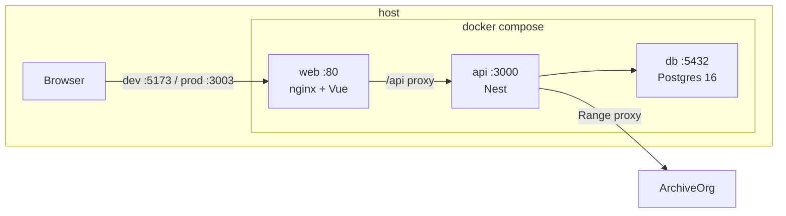

# 3. Plan Técnico y Diseño de Arquitectura (Plan) — Campus Marte

> **Fase SDD:** `3/4 — Technical Plan`
> **Estado:** `🟡 En revisión (v1.0.0)`
> **Versión:** `1.0.0`
> **Última actualización:** 2026-09-16
> **Trazabilidad:** implementa [`2_spec.md`](./2_spec.md) v1.0.0, que deriva de [`1_intent.md`](./1_intent.md) v1.1.0
> **Rol:** Principal Cloud Architect / Full Stack

---

## 3.1. Resumen

```text
Monolito modular de 3 contenedores — Vue 3 + Naive UI (nginx) · NestJS 10
(Prisma, dominio puro) · PostgreSQL 16 — levantado con un único
docker-compose.yml. El progreso, la máquina de estados y el heatmap son
funciones TypeScript sin I/O, testeadas primero. HTTP y Prisma son
adaptadores. CI: GitHub Actions self-hosted (joaldico) → GHCR → misma EC2
que josue-diaz-web, detrás de proxy-reverse en
https://beonittest.josuediazcontreras.com.
```

---

## 3.2. ADRs

### ADR-001 — Tres contenedores, no microservicios

| Campo | Contenido |
|---|---|
| **Estado** | Aceptada |
| **Decisión** | `web`, `api`, `db` en un compose. Nest organizado por módulos (`auth`, `catalog`, `player`, `admin`, `playback`) con carpeta `src/domain` sin Nest ni Prisma. |
| **Por qué** | El enunciado pide una API y una DB, no un mesh. El evaluador clona y hace `up`. |
| **Descartado** | Microservicios; API Gateway; Redis/Celery (el heatmap del seed cabe en un request). |

### ADR-002 — Dominio puro + TDD (el cero de “progreso en cliente”)

| Campo | Contenido |
|---|---|
| **Estado** | Aceptada |
| **Decisión** | `ProgressEngine`, `CourseStateMachine`, `PlaybackIngestor`, `HeatmapEngine` en `api/src/domain/**`, cero imports de `@nestjs/*`. Tests Vitest/Jest **antes** del controller. Vue solo pinta `ranges` / `ratio` del JSON. |
| **Descartado** | Calcular unión en el reproductor “y luego mandar el porcentaje”. |

### ADR-003 — Prisma Migrate, no TypeORM

| Campo | Contenido |
|---|---|
| **Estado** | Aceptada |
| **Decisión** | Prisma 6 + PostgreSQL 16. Seed en `prisma/seed.ts` invocado al arrancar si `RUN_SEED=true` (compose). Recarga a cero = `docker compose down -v && docker compose up --build`. |
| **Por qué** | Schema explícito = DECISIONS.md más fácil; migraciones en el repo. |
| **Descartado** | TypeORM (más boilerplate); SQL crudo suelto. |

### ADR-004 — Sesión cookie, no JWT de producción

| Campo | Contenido |
|---|---|
| **Estado** | Aceptada |
| **Decisión** | Login `{ userId }` → `sessions` + cookie `sid` httpOnly, `SameSite=Lax`, `Secure` si HTTPS. TTL 7 días. El enunciado pide lista sin contraseña; JWT RS256 sería teatro. |
| **Descartado** | JWT access+refresh (overkill y no pedido). `localStorage.userId` como única auth (el cliente podría falsificar progreso **si el API se lo cree**; el API **siempre** toma el user de la sesión, nunca del body salvo el import admin). |

### ADR-005 — Naive UI + `<video>` nativo

| Campo | Contenido |
|---|---|
| **Estado** | Aceptada |
| **Decisión** | Vue 3 + Vite + Naive UI + `vue-draggable-plus` + Vue Router. Reproductor = `<video>` + canvas/div de ranges. Logo copiado a `web/public/logo.png`. |
| **Descartado** | Vuetify, PrimeVue, diseño desde cero, video.js (otra superficie de errores de consola). |

### ADR-006 — Proxy Range de vídeo en Nest

| Campo | Contenido |
|---|---|
| **Estado** | Aceptada (activar si CORS falla; default: probar URL directa primero en M1) |
| **Decisión** | `VideosService.stream(id, rangeHeader)` hace fetch al origin con `Range` y pipea. El `<video src>` apunta a `/api/videos/:id/stream` si el probe de M1 detecta CORS error. Flag `VIDEO_PROXY=true` en compose. |
| **Por qué** | Cero por errores de consola. archive.org a veces envía CORS, a veces no. |
| **Descartado** | Descargar mp4 al disco de la EC2 en el MVP (bonus = upload). |

### ADR-007 — OpenAPI generado

| Campo | Contenido |
|---|---|
| **Estado** | Aceptada |
| **Decisión** | `@nestjs/swagger` + plugin CLI. `/api/docs`. DTOs class-validator = contrato. |
| **Descartado** | `openapi.yaml` escrito a mano. |

### ADR-008 — Deploy: mismo patrón `josue-diaz-web`

| Campo | Contenido |
|---|---|
| **Estado** | Aceptada |
| **Decisión** | Workflow `runs-on: [self-hosted, Linux, X64]`, login GHCR, `docker compose -f docker-compose.prod.yml up -d`. Puertos host: web `3003`, api `4003`. `proxy-reverse` añade `server_name beonittest.josuediazcontreras.com` → `3003`; `/api` → `4003`. Certbot webroot igual que josuediazcontreras.com. DNS A del subdominio → misma IP pública. Postgres **sin** puerto publicado en prod. |
| **Descartado** | ECS/Fargate/RDS; runner GitHub-hosted (rompería el patrón y el compose en la EC2). |

### ADR-009 — Monorepo plano `api/` + `web/`

| Campo | Contenido |
|---|---|
| **Estado** | Aceptada |
| **Decisión** | Sin Nx/Turborepo. Compose en raíz. Un Dockerfile por servicio, multi-stage, non-root. |
| **Descartado** | Yarn workspaces complejos; frontend servido por Nest (el evaluador espera SPA+API). |

---

## 3.3. Contenedores y red



**Compose raíz (`docker-compose.yml`)** — el del enunciado, sirve para local Y para el evaluador:

| Service | Image | Ports (local) | Notas |
|---|---|---|---|
| `db` | `postgres:16-alpine` | `5432:5432` solo local | healthcheck `pg_isready` |
| `api` | build `api/` | `3000:3000` | waits for db healthy; `prisma migrate deploy && prisma db seed` |
| `web` | build `web/` | `80:80` | nginx `try_files` + `proxy_pass /api → api:3000` |

Prod (`docker-compose.prod.yml`): mismos servicios, **sin** publicar 5432; web `3003:80`, api `4003:3000` (o api solo en red interna y nginx del proxy pega a 4003). Preferible: publicar web 3003 y api 4003 para que `proxy-reverse` (network_mode host) los alcance.

Recarga a cero:

```bash
docker compose down -v && docker compose up --build
```

---

## 3.4. Mapa de ficheros (locked)

```
marte-campus/
  docker-compose.yml
  docker-compose.prod.yml
  README.md
  DECISIONS.md
  .github/workflows/ci.yml          # PR: lint + test + build
  .github/workflows/deploy.yml      # main: GHCR + compose prod
  api/
    Dockerfile
    prisma/schema.prisma
    prisma/seed.ts
    prisma/migrations/
    src/main.ts
    src/domain/progress.ts          # puro
    src/domain/state-machine.ts
    src/domain/ingest.ts
    src/domain/heatmap.ts
    src/modules/auth/
    src/modules/catalog/
    src/modules/player/
    src/modules/playback/
    src/modules/admin/
    src/modules/videos/
    test/domain/*.spec.ts
    test/http/*.spec.ts
  web/
    Dockerfile
    nginx.conf
    public/logo.png
    src/main.ts
    src/App.vue
    src/layouts/AppLayout.vue
    src/pages/LoginPage.vue
    src/pages/CatalogPage.vue
    src/pages/CoursePage.vue
    src/pages/PlayerPage.vue
    src/pages/admin/AdminCoursesPage.vue
    src/pages/admin/AdminCourseDetailPage.vue
    src/pages/admin/AdminHeatmapPage.vue
    src/api/client.ts               # fetch, sin calcular progreso
```

---

## 3.5. Seed y duraciones

Al seed: insertar vídeos; para cada URL, `ffprobe` (imagen api con ffmpeg estático **o** duración hardcodeada medida una vez y metida en `seed.ts` como constante documentada). Preferencia: **constantes medidas en M1** (un script `npm run probe:durations`) y valores commiteados — `docker compose up` en la máquina del evaluador **no** depende de archive.org para el 90 %.

Si el probe falla en M1, se usan duraciones conservadoras documentadas y se explica en DECISIONS.md.

---

## 3.6. Cliente de reproducción (sin negocio)

| Evento browser | Acción |
|---|---|
| `timeupdate` (acumular) | Buffer local de `[from,to)` en curso |
| cada 5 s / `pause` / `ended` | `POST /playback/events` |
| `seeked` | **cierra** el tramo anterior en `from` del seek; **no** envía el salto |
| `visibilitychange` hidden / `pagehide` | `fetch(..., keepalive: true)` o `sendBeacon` al mismo endpoint |
| `loadedmetadata` | `currentTime = cursor` del GET player |

Vue guarda `ranges` de la última respuesta y los dibuja. Prohibido `reduce` sobre eventos para pintar porcentaje.

---

## 3.7. CI/CD

**ci.yml** (`pull_request` + `push`): `api` lint+test, `web` `vue-tsc`+build.

**deploy.yml** (`push` main), copia de [josue-diaz-web](https://github.com/joaldico/josue-diaz-web):

```yaml
runs-on: [self-hosted, Linux, X64]
# docker login ghcr.io
# build+push ghcr.io/joaldico/marte-campus-api:latest
# build+push ghcr.io/joaldico/marte-campus-web:latest
# docker compose -f docker-compose.prod.yml pull && up -d
```

Cambio en **otro repo** `proxy-reverse`: server block + certbot `-d beonittest.josuediazcontreras.com`. DNS A. Se hace en hito M8, no bloquea el compose local (entregable).

---

## 3.8. Presupuesto de calidad

- Tests de dominio: tabla de §2.2.4 + merge + 90 % + todas las transiciones ilegales.
- Tests HTTP: CA-01..CA-08 con supertest y DB de test (compose service `db` o postgres efímero).
- `strict: true` TS en api y web.
- Imágenes non-root.

---

## 3.9. Riesgos técnicos residuales

| Riesgo | Mitigación en plan |
|---|---|
| CORS archive.org | ADR-006, spike en T-1.x |
| Runner self-hosted caído | El entregable no depende de la demo |
| Cookie Secure en http://localhost | `Secure` solo si `X-Forwarded-Proto=https` |
| Drag-and-drop Naive + vue-draggable-plus | Probar en M5 con lista corta |

---

## ✅ Gate

- [x] ADRs de stack, dominio puro, Prisma, sesión, Naive UI, proxy, OpenAPI, deploy.
- [x] Mapa de ficheros y compose.
- [ ] Aprobación para [`4_tasks.md`](./4_tasks.md).
